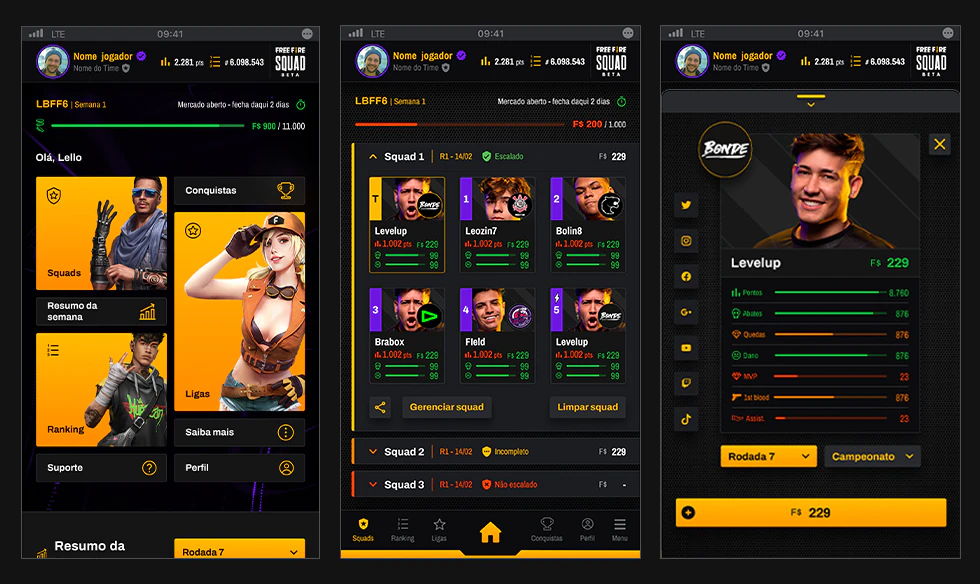
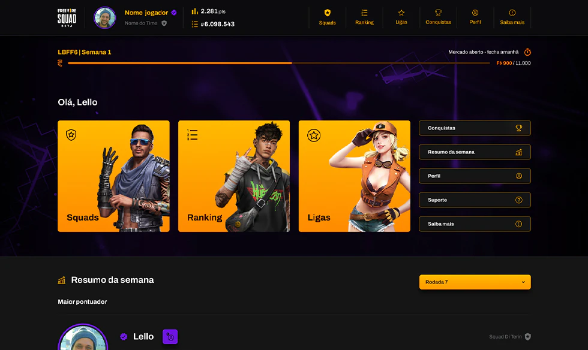

This project was a big one. Using Vue and Nuxt, we had to develop this WebApp to go with Free Fire e-sport competition(Brazilian Free Fire League, or LBFF). 

In FF SQUAD players need to assemble teams of five pro players and a coach to score during the match days. Depending on the actual performance of the pro players on those days, the player will receive more or less points.

The game also features real pro player data so users have details about their favorite pro players’ performance over the past few weeks and make their best choices.

