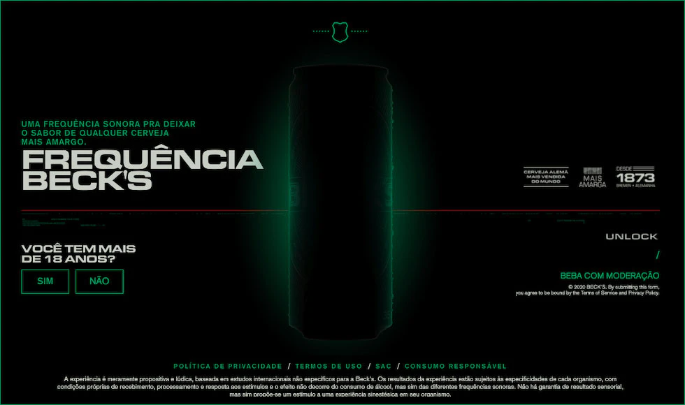
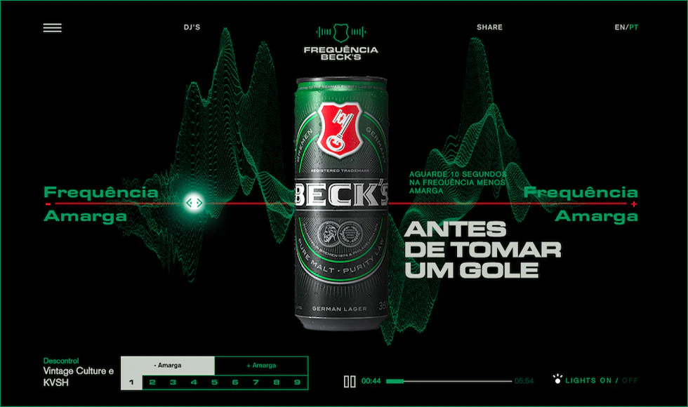
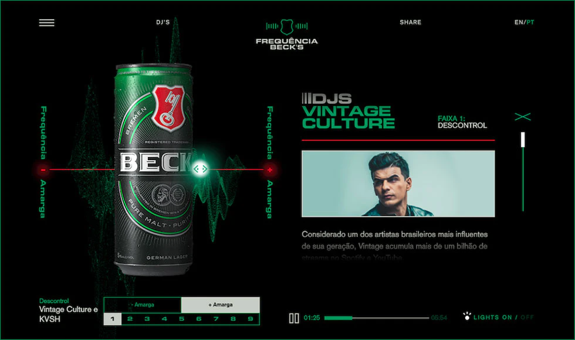
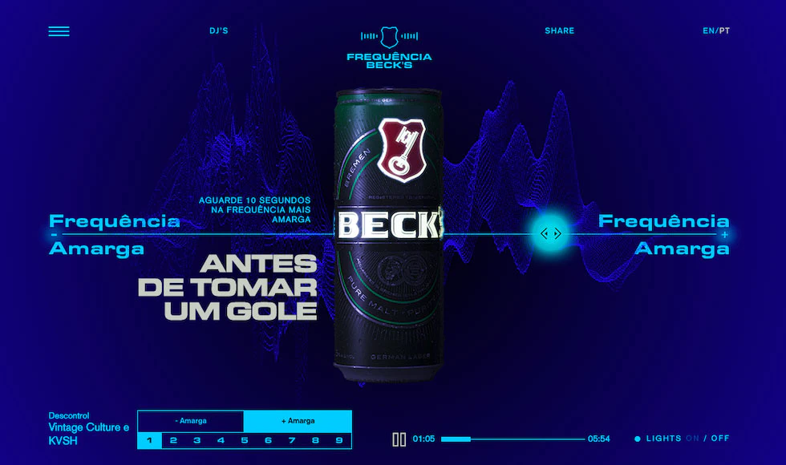

This project was my first React Project, and because of that, it has a special meaning to me. It was a complex idea, so I had a lot of help from a colleague (backend developer). I was responsible for all front end, and implementing the layout and he did all the complex implementation of music, and graphics.

