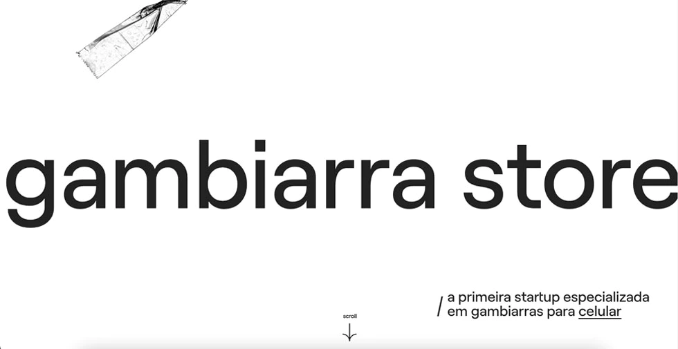
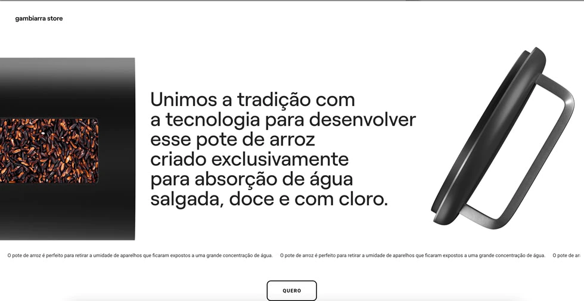
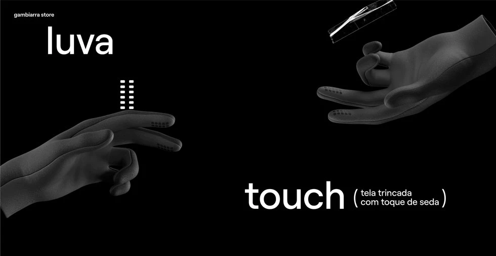
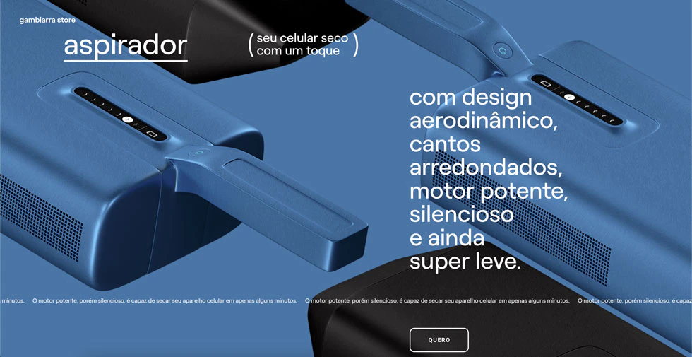

This was another challenging project. The whole site required a lot of animation related to scroll. The main idea was to have sections with different products, and each section had animations that would kind of follow the scroll. If the user scroll down, the animation would go forward, and if the user scrolled up, the animation would reverse.

At the end of the project, I was really happy with the results. And luckly, the client was happy with it too. 

