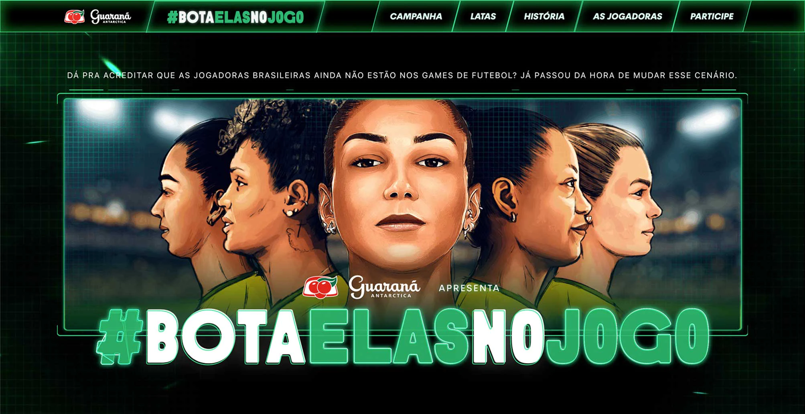
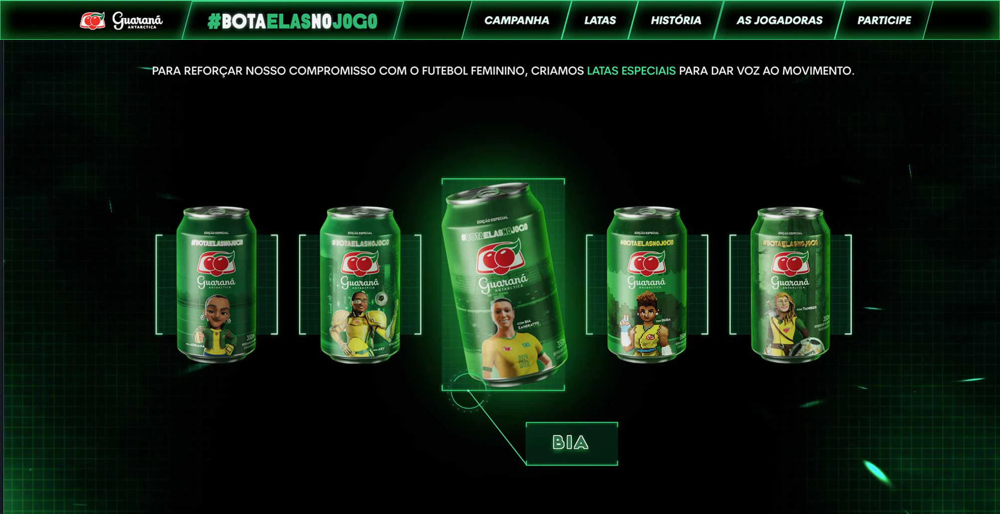
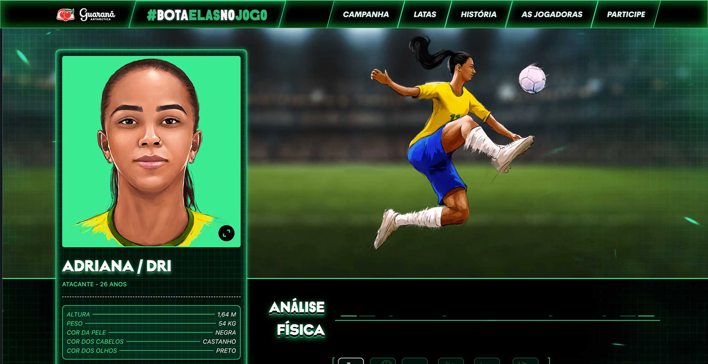

The idea behind this project was to introduce female characters/players to soccer videogames. This was a really fun project to work on. 

It had a few animations, like the soda can moving when the user hovered, and appearing the name of the player, and the player's information appearing when hovering the illustration.

Another cool thing that I had to work on, was the infographics with player's stats. It was my first time using [echarts](https://echarts.apache.org/), and I honestly loved it.

