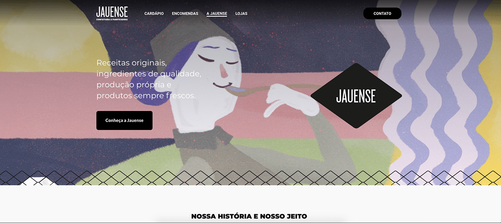

This was one of my favorite projects to work on. It's a dynamic Website, developed first with static HTML and CSS, with Foundation Framework and after that, transformed into a Dynamic WordPress Website.

Their old website was just terrible, and not functional at all (picture below). It was a boxed content with lots of unused and ugly white space. Their main menu was some icons at the bottom of the page. They needed a new website with a modern design and they also needed a simple but complete way to add content to it. The solution was simple: Create a theme for a WordPress website.

*Old Website - Home Page (1) | Internal Page (2) | Contact Page (3)*

The new layout was created by a colleague, from the Design Team, at Coopers. With the design approved and ready to go, I developed the Static Front-End, with the Foundation Framework. When these 5 static pages were ready to go, and the approval of our client, I started to transform these pages into PHP components, that later would become the page builder components. To build these components and templates, we use a WordPress plugin called Advanced Custom Fields. 

*New Website - About Page (3) | Contact (4) | Menu Page (5)*

With Advanced Custom Fields, every text in the Website is dynamic and can be updated in the Admin Area. All the pages are composed by content blocks, that can be organized anyway the client wants. And the contact info, such as phone number, location of the stores and open hours, are entered once in a settings page, and reused throughout the whole website (Contact page, Footer, etc).

Check out the Website in the URL: [confeitariajauense.com.br](http://confeitariajauense.com.br/)