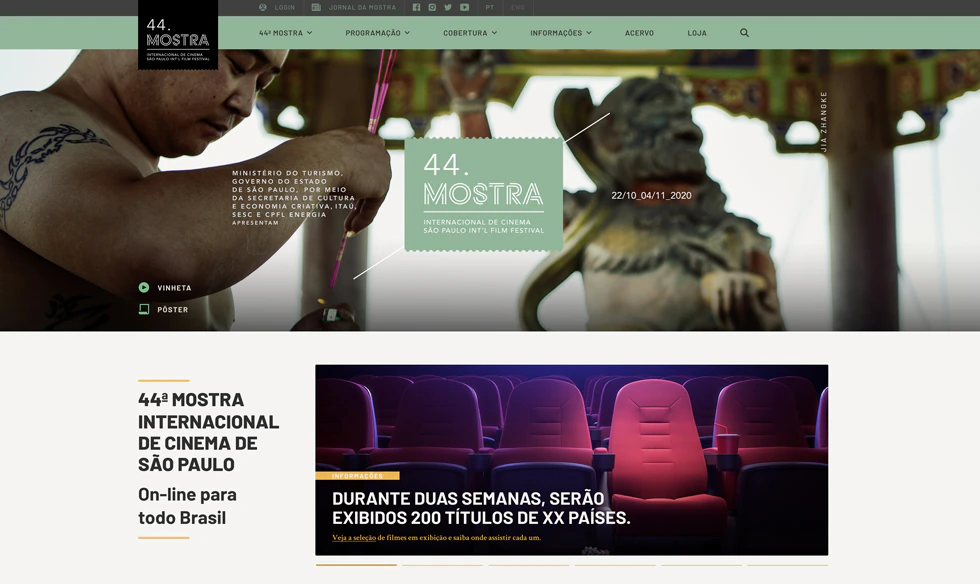
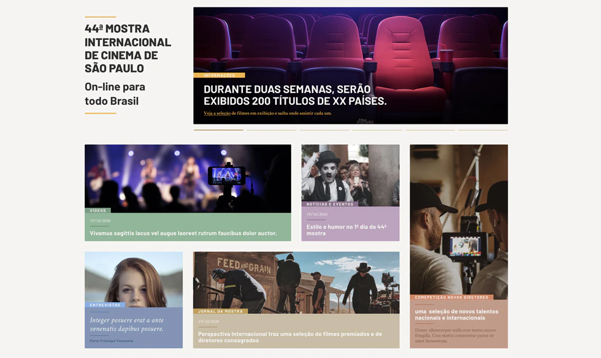
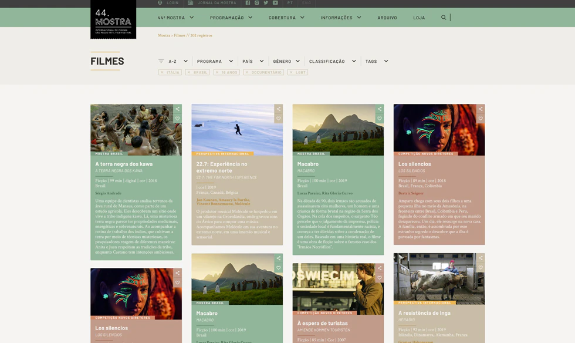
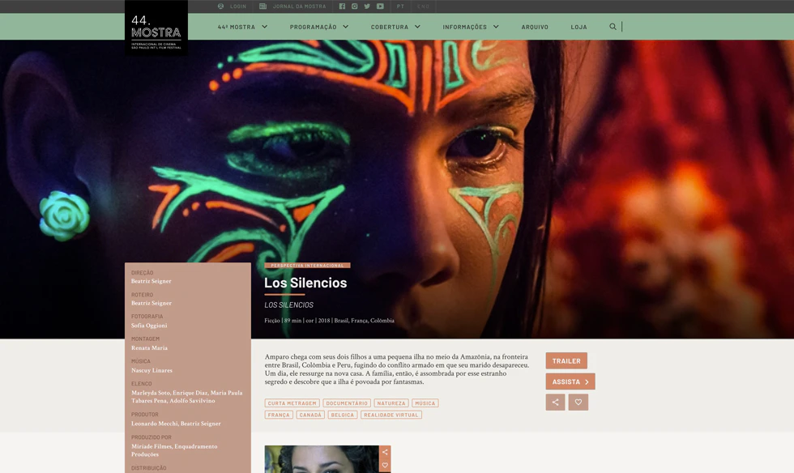
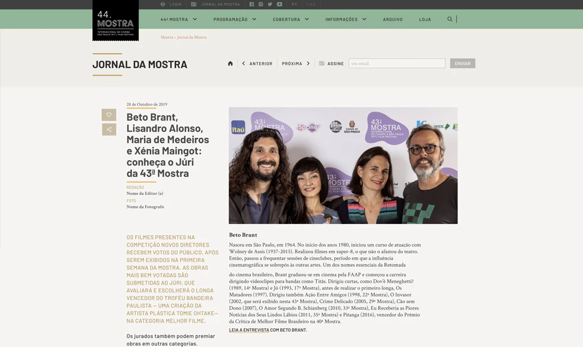

This was one of the biggest projects that I worked on. With Vue+Vuetify+Nuxt, we had to create a website to host the São Paulo Internation Film Festival, that because of Covid, had to be mostly online.

The design was created based on the Poster art by Jia Zhangke, by a designer in partnership with Webcore. And the Front-end developed by me, using Vue, Vuetify and Nuxt.

As I said, it was a big project, because they needed the site to have all the schedule for the film, along with all their information (such as credits, summary, images, trailers...), and also, information about the festival. So it had a lot of information and a lot of pages.

But I was so happy with the final result, and so was the client. 

*44th São Paulo International Film Festival - Home Page (1 | 2) | Film Listing Page (3) | Film Internal Page (4) | Blog Content Page (5)*

Check out the full website at [44.mostra.org](https://44.mostra.org/)