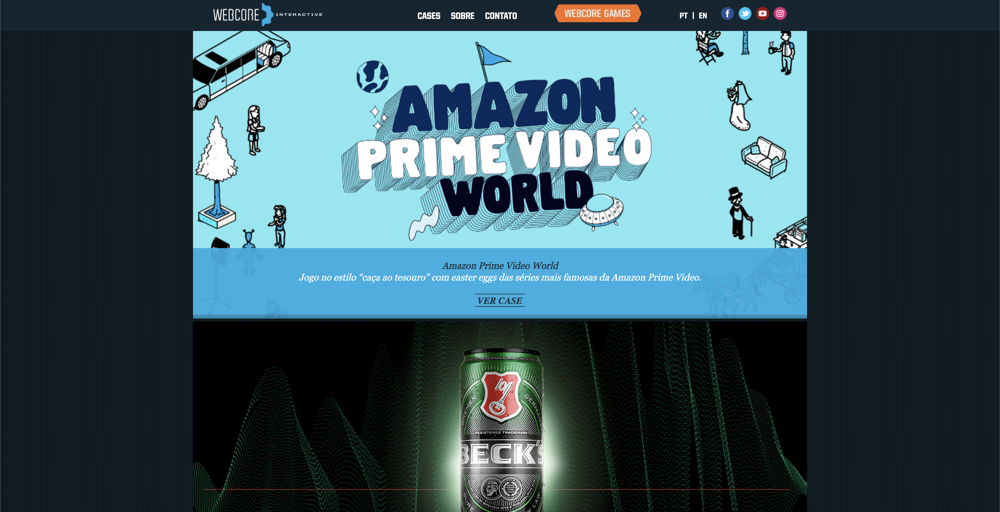
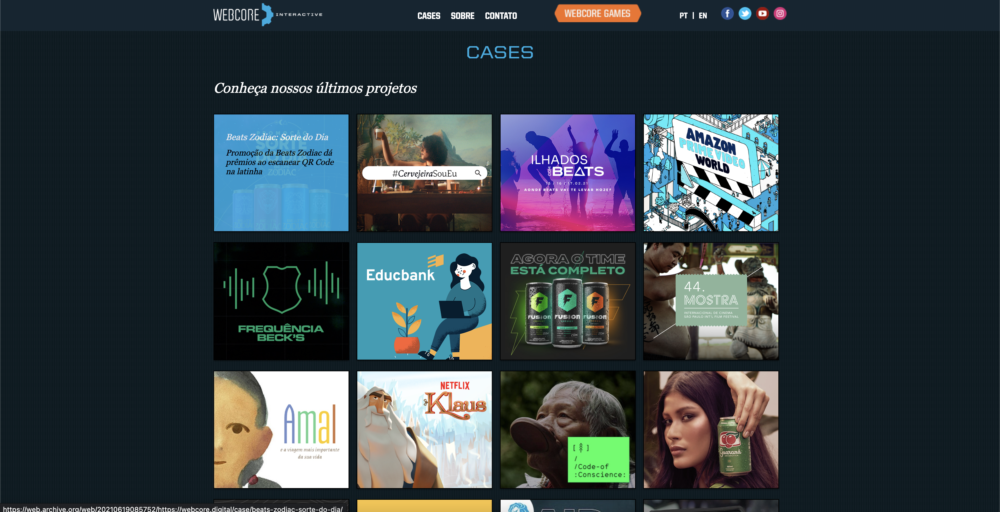
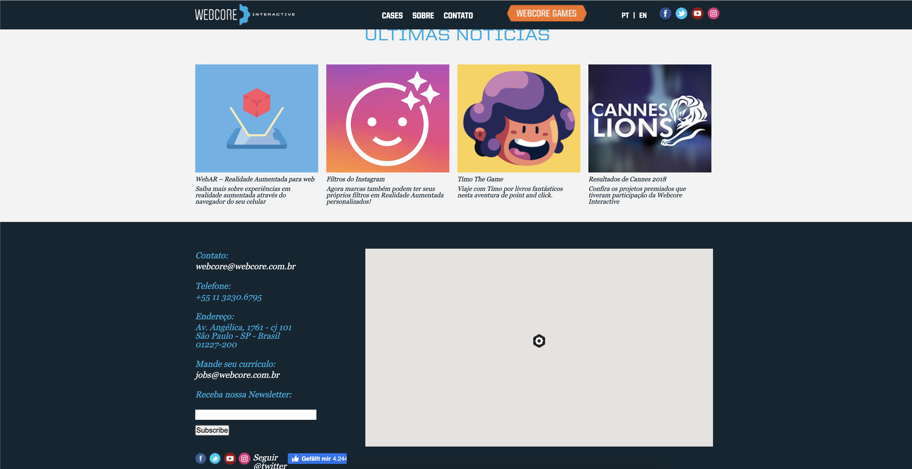
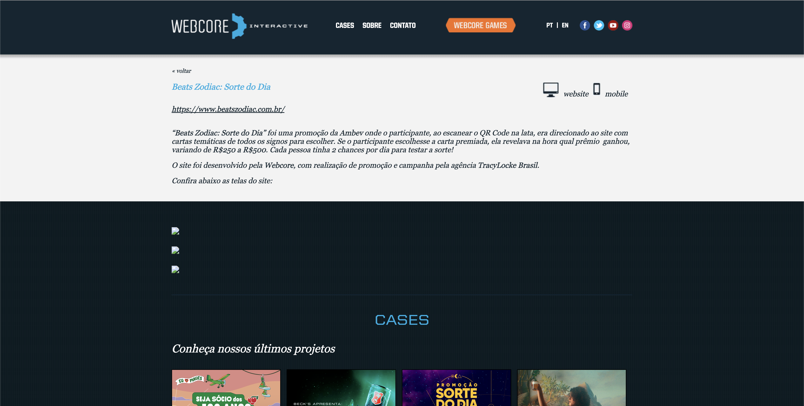
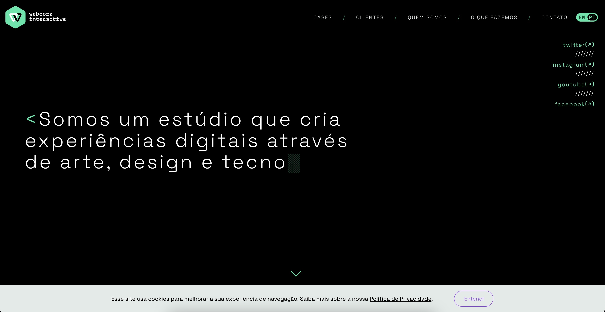
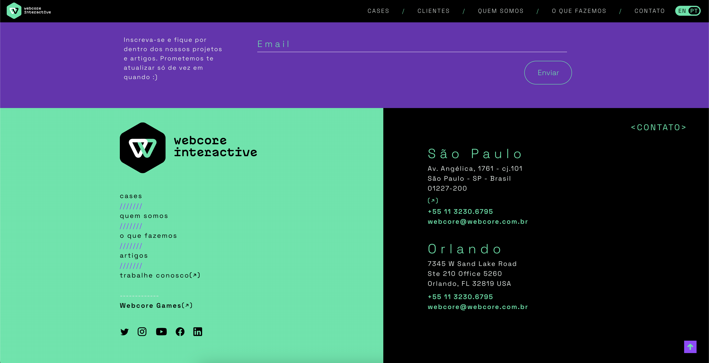
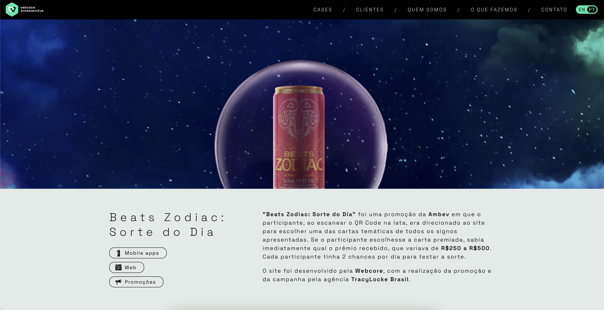

The challenge here was redesign a very old and outdated website for Webcore. The new website was developed with Vue.js, Nuxt, and DatoCMS.

I really enjoyed working on this, because we didn't have a strict deadline, so I had time to focus on all the details, like hover animation to links, highlight colors, and other stuff that I usually don't have time to think about.

Here was also the first time that I had to work with DatoCMS integration, and GraphQL. Dato uses GraphQL to get the CMS content, and it is really easy to inject on Vue, which is what we usually use on our projects. 

*Old Site - Webcore Interactive - HomePage (1 | 2 | 3) | Case Page (4)*

*New Website - Webcore Interactive - HomePage (5 | 6 | 7) | Case Page (8 | 9)*

Check out the full website at [webcore.digital](https://webcore.digital/)